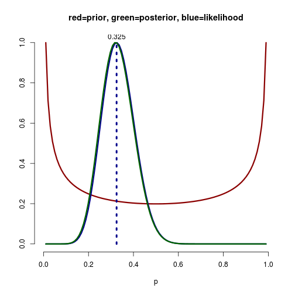
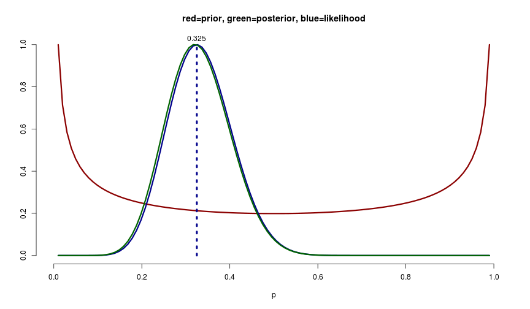

## What is it about?
  the application is a shiny application of what [brain caffo](https://github.com/bcaffo/) implemented with RStudios manipulate function with some trivial changes. his code is available [here](https://datasciencespecialization.github.io/courses/06_StatisticalInference/02_05_Bayes/index.html#9)

### Bayesian Analysis
  - It is possible to estimat a parameter (Θ), when we have some sort of rough information or guess for what parameter might be
  - It works fine even when we have relatively little amount of data.
  - When no data are available, a prior distribution is used to quantify our knowledge about the parameter
  - All inferences are then performed on the distribution of the parameter given the data, called the posterior
  - We model our data with likelihood and call the most probable result acording our model "the Maximum Likelihood Estimate (MLE)"

---


## Model
  * We assume a bionomial distribution so PMF can be described as
  $$f(x,\theta) = \theta^x (1-\theta)^{1-x} \quad for \quad \theta \in[0,1]$$
  * We define 𝓛(Θ,x,n) where x is number of success and n is number of trials
  * MLE can be defined as x/n which is shown with dotted line in the plot

### The code

```r
pvals <- seq(0.01, 0.99, length=100)
x <- 13; n <- 40; alpha <- 0.5; beta <- 0.5
plot(0:1, 0:1, type="n", xlab="p", ylab="", frame=F)
lines(pvals, dbeta(pvals, alpha, beta) / max(dbeta(pvals, alpha, beta)), lwd=3, col="darkred")
lines(pvals, dbinom(x, n, pvals) / dbinom(x, n, x/n), lwd=3, col="darkblue")
lines(pvals, lwd=3, dbeta(pvals, alpha+x, beta+(n-x)) / max(dbeta(pvals, alpha+x, beta+(n-x))), col="darkgreen")
lines(c(x/n,x/n), 0:1, col="darkblue", lwd=4, lty="dotted")
text(x/n, 1.03, round(x/n, 3))
title("red=prior, green=posterior, blue=likelihood")
```

 

---

## Densities
 

---

## Run the application
  * you have to have shiny package installed on R  `> install.packages(shiny)`
  * set the path and run following command  `$ Rscript -e "library(shiny);runApp()"`
  * you can also do it in R REPL  `> library(shiny);runApp()`


### Conclusion
you can play around the with x, n, alpha and beta and see how they change our likelihood, prior and posterior densities. note that all the density functions are normalized so their maximum values are at 1.

at the end hopefully you can use this application to understand the concept intuitively. when the sample size n increases the influence of the prior mean diminishes. On the other hand when n is small and our prior opinion about µ is strong the posterior mean is close to the prior mean µ.
